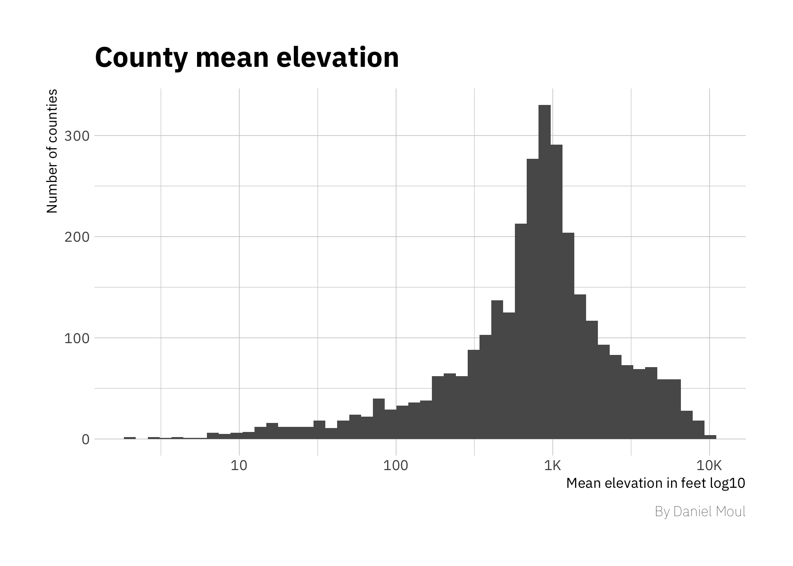
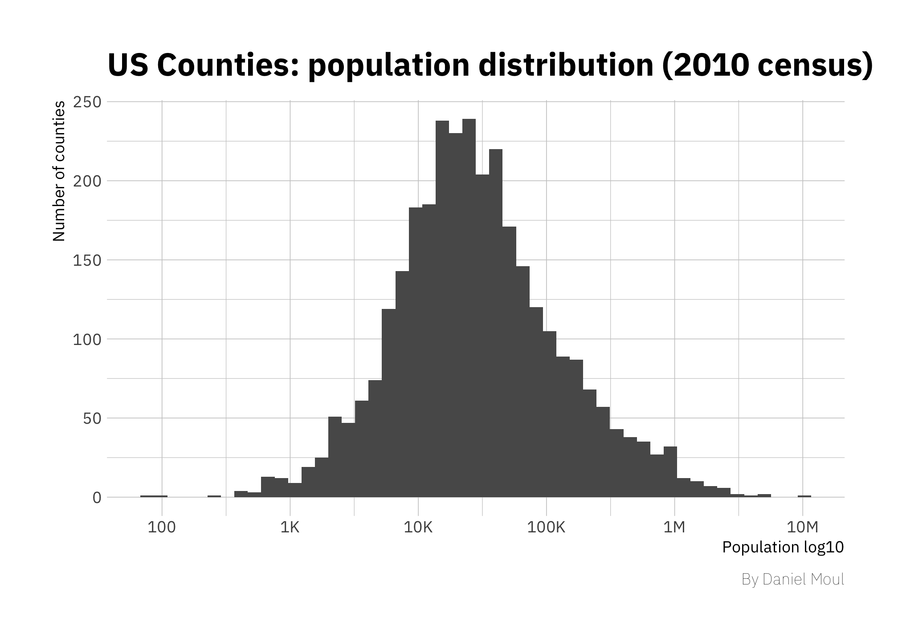
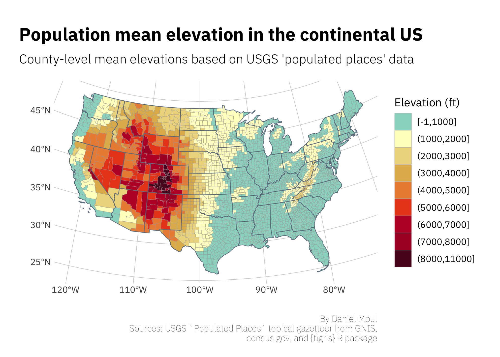
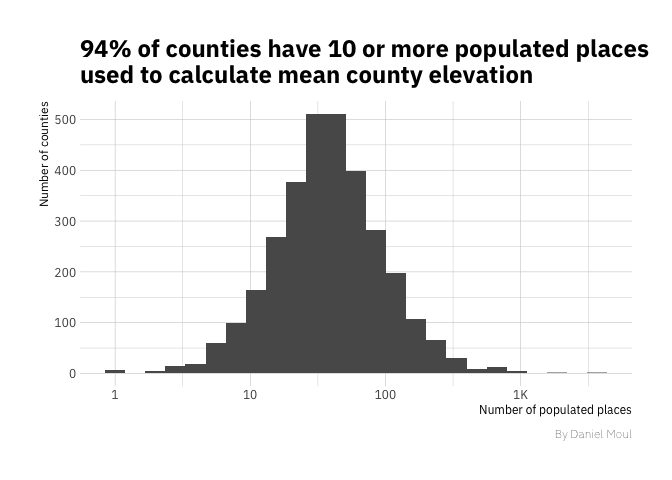
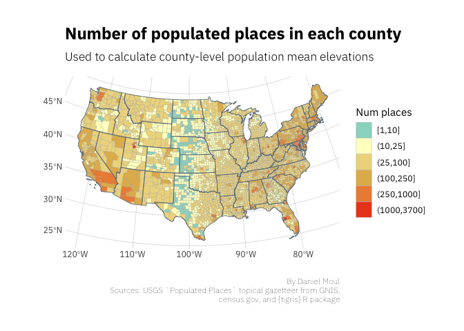

Mean Population Elevation in the Continental USA
================
Daniel Moul
2020-07-26

 

The continental United States has vast flat plains and long mountain
ranges. But what do people experience? They don’t live at the the
extreme highest and lowest elevations. What do people experience? One
way to answer this question is find the average elevation of the
population of the USA. We can approximate the answer by doing the
following:

1.  Calculate the mean elevation of each county
2.  Get the population of each county
3.  Calculate a weighted mean elevation based on the above

 

## 1\. Get mean elevation of each county

We can approximate the mean elevation of each county using the
‘populated places’ data set from the USGS [Populated
Places](https://geonames.usgs.gov/docs/stategaz/POP_PLACES.zip) topical
gazetteer from GNIS. Most counties have more than 10 populated places,
and we can average them to get an approximation for the mean elevation
of the county.

<table class="table table-striped table-condensed table-responsive" style="width: auto !important; margin-left: auto; margin-right: auto;">

<caption>

Example data from USGS ‘Populated Places’ data set with calculated mean
elevation per county

</caption>

<thead>

<tr>

<th style="text-align:left;">

state\_alpha

</th>

<th style="text-align:left;">

state\_numeric

</th>

<th style="text-align:left;">

county\_name

</th>

<th style="text-align:left;">

county\_numeric

</th>

<th style="text-align:right;">

n\_poplulated\_places

</th>

<th style="text-align:right;">

mean\_elev\_in\_m

</th>

<th style="text-align:right;">

mean\_elev\_in\_ft

</th>

</tr>

</thead>

<tbody>

<tr>

<td style="text-align:left;">

IA

</td>

<td style="text-align:left;">

19

</td>

<td style="text-align:left;">

Jackson

</td>

<td style="text-align:left;">

097

</td>

<td style="text-align:right;">

41

</td>

<td style="text-align:right;">

232

</td>

<td style="text-align:right;">

763

</td>

</tr>

<tr>

<td style="text-align:left;">

MN

</td>

<td style="text-align:left;">

27

</td>

<td style="text-align:left;">

Polk

</td>

<td style="text-align:left;">

119

</td>

<td style="text-align:right;">

56

</td>

<td style="text-align:right;">

307

</td>

<td style="text-align:right;">

1007

</td>

</tr>

<tr>

<td style="text-align:left;">

MO

</td>

<td style="text-align:left;">

29

</td>

<td style="text-align:left;">

Pemiscot

</td>

<td style="text-align:left;">

155

</td>

<td style="text-align:right;">

71

</td>

<td style="text-align:right;">

80

</td>

<td style="text-align:right;">

264

</td>

</tr>

<tr>

<td style="text-align:left;">

MS

</td>

<td style="text-align:left;">

28

</td>

<td style="text-align:left;">

Smith

</td>

<td style="text-align:left;">

129

</td>

<td style="text-align:right;">

36

</td>

<td style="text-align:right;">

130

</td>

<td style="text-align:right;">

427

</td>

</tr>

<tr>

<td style="text-align:left;">

NC

</td>

<td style="text-align:left;">

37

</td>

<td style="text-align:left;">

Pender

</td>

<td style="text-align:left;">

141

</td>

<td style="text-align:right;">

72

</td>

<td style="text-align:right;">

11

</td>

<td style="text-align:right;">

35

</td>

</tr>

<tr>

<td style="text-align:left;">

NC

</td>

<td style="text-align:left;">

37

</td>

<td style="text-align:left;">

Tyrrell

</td>

<td style="text-align:left;">

177

</td>

<td style="text-align:right;">

19

</td>

<td style="text-align:right;">

1

</td>

<td style="text-align:right;">

3

</td>

</tr>

<tr>

<td style="text-align:left;">

PA

</td>

<td style="text-align:left;">

42

</td>

<td style="text-align:left;">

Butler

</td>

<td style="text-align:left;">

019

</td>

<td style="text-align:right;">

182

</td>

<td style="text-align:right;">

366

</td>

<td style="text-align:right;">

1202

</td>

</tr>

<tr>

<td style="text-align:left;">

TX

</td>

<td style="text-align:left;">

48

</td>

<td style="text-align:left;">

Borden

</td>

<td style="text-align:left;">

033

</td>

<td style="text-align:right;">

3

</td>

<td style="text-align:right;">

861

</td>

<td style="text-align:right;">

2826

</td>

</tr>

<tr>

<td style="text-align:left;">

TX

</td>

<td style="text-align:left;">

48

</td>

<td style="text-align:left;">

Gray

</td>

<td style="text-align:left;">

179

</td>

<td style="text-align:right;">

15

</td>

<td style="text-align:right;">

920

</td>

<td style="text-align:right;">

3017

</td>

</tr>

<tr>

<td style="text-align:left;">

WV

</td>

<td style="text-align:left;">

54

</td>

<td style="text-align:left;">

Monongalia

</td>

<td style="text-align:left;">

061

</td>

<td style="text-align:right;">

123

</td>

<td style="text-align:right;">

327

</td>

<td style="text-align:right;">

1072

</td>

</tr>

</tbody>

</table>

 

 

## 2\. Get population by county

I downloaded county-level population estimates from ACS 2014-2018 via
the Census Bureau’s Planning Database at
<https://www.census.gov/topics/research/guidance/planning-databases.2020.html>

 

 

## 3\. The answer

The average elevation of the population of the USA is 856 ft, which is a
weighted mean based on county population. Compare that to the simple
average of county elevation: 1302 ft. It seems reasonable to me that
weighted mean is lower elevation than the simple mean, since there are
more people near the coasts in higher-density counties than in the
middle of the country and in mountainous areas.

Note that counties in Alaska and Hawaii were included when calculating
the mean, however they are not included in the plot below.

 

 

 

## 4\. Notes

Can we rely on the population mean elevation calculated based on
“populated places?” Yes, because (1) 94% of the counties have more
than 10 populated places ; and (2) those with less are mostly sparsely
populated ranching and farming areas in a band from Texas to North
Dakota where it’s relatively flat.

 

 

   

(end of document)
