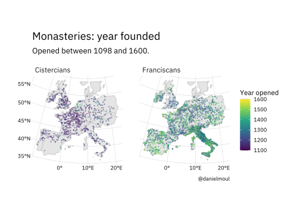
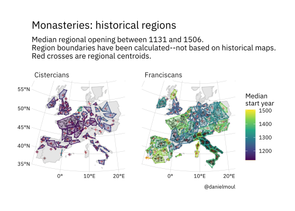
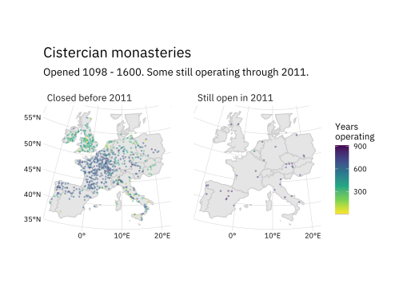
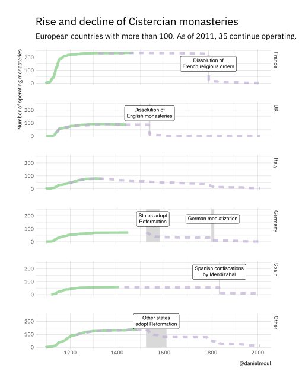

Cistercian and Franciscan Monasteries in Europe
================
Daniel Moul
2020-08-01

 

For nearly a thousand years the Cistercian and Franciscan religious
orders have been active in Europe. When and where were monasteries
opened? When did they close? To answer these questions, I’ll use data
compiled by Serra Boranbay and Carmine Guerriero and brought to my
attention in Jeremy Singer-Vine’s newsletter *Data is Plural*. This data
set includes European monasteries of these two orders founded in the
years 1000-1600. Monasteries opened later or beyond Europe are not
included.

 

## Openings

The Order of Cistercian was founded in 1098, branching from the
Benedictines. The boom in opening Cistercian monasteries occurred during
the twelfth and thirteen centuries. The Franciscans, a group of related
religious orders, was founded in 1209 and continued opening new
monasteries into the 16th century. Since the data set includes
Franciscan monasteries opened prior to 1209, presumably these older
monasteries joined the Franciscans at a later date.

The geographic dispersal of the movement to open monasteries is more
visible when looking at historical administrative regions colored by
median opening date of the monasteries in each region.

 

## Duration operating

Many Cistercian monasteries operated well over 500 years, the
longest-running mainly were located in states in which the Protestant
Reformation was not culturally or politically dominant.

The Cistercian boom tapered off by 1300; after that most newly founded
Cistercian monasteries were outside the core western European Catholic
countries. The Franciscans had two major pushes: one in the 12th and
13th centuries, and one in the 15th (pre-reformation).

 

## Closings

The decline was gradual over long periods of time with short-duration
cataclysmic political events wiping out most monasteries. Presumably,
these were the result of the Roman Church aligning itself with political
movements that lost power, and those in power seeing the religious
orders as too powerful, too wealthy, or antithetical to Protestant
sensibilities. Since I lack closing dates for Franciscan monasteries, I
look at only Cistercian closings below.

## Sources and Limitations

The data for these plots comes from *A novel dataset on a culture of
cooperation and inclusive political institutions in 90 European
historical regions observed between 1000 and 1600* by Serra Boranbay and
Carmine Guerriero. 2352-3409/© 2019 The Author(s). Published by Elsevier
Inc. This is an open access article under the CC BY-NC-ND license
(<http://creativecommons.org/licenses/by-nc-nd/4.0/>).
<https://doi.org/10.1016/j.dib.2019.104731>

Data is Plural newsletter 2019.11.27 edition by Jeremy Singer-Vine.
Click
[here](http://mail01.tinyletterapp.com/data-is-plural/data-is-plural-2020-07-15-edition/17497722-tinyletter.com/data-is-plural?c=ff36a4dc-f6ae-4c3a-ab19-b5dd03050c60)
to subscribe.

Wikipedia entries:
[Cistercians](https://en.wikipedia.org/wiki/Cistercians) and
[Franciscans](https://en.wikipedia.org/wiki/Franciscans)

It’s possible that there are errors and omissions in the data. The data
set covers the years 1000-1600. Monasteries opened later or beyond
Europe are not included.

## For current information

Both orders have spread around the world and remain active. See the
orders’ websites for more information:

  - Cistercians: [ocist.org](http://www.ocist.org/ocist/en/) and
    [cistopedia.org](https://www.cistopedia.org)
  - Franciscans: [franciscan.org](https://www.franciscan.org)

    (end of document)
