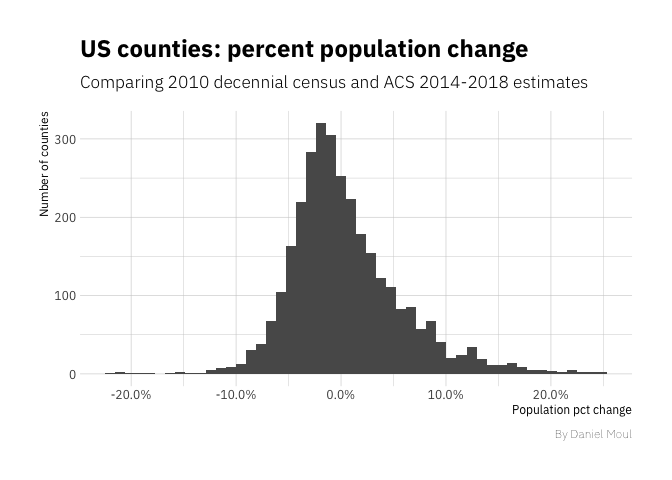
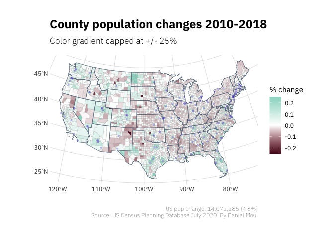
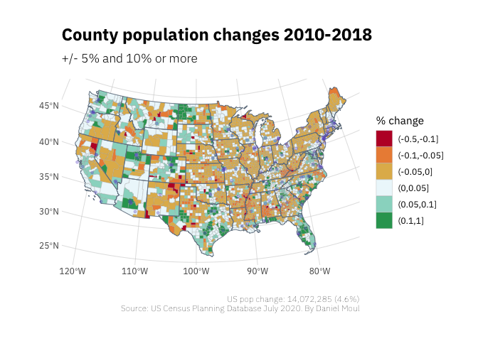
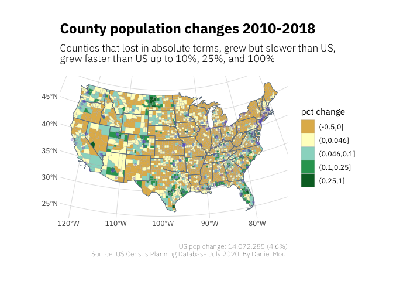
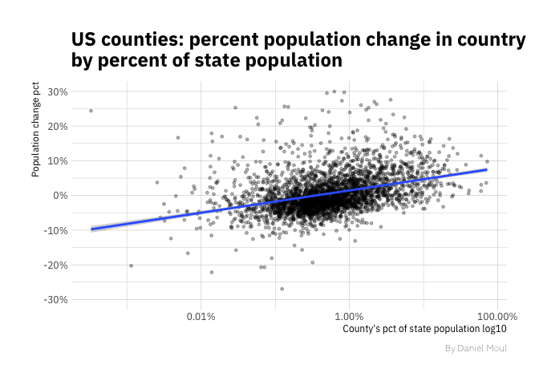
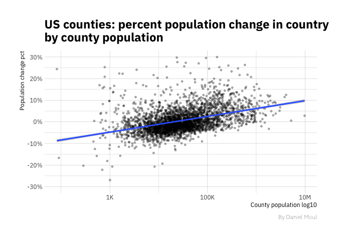

US county population shifts 2010-2018
================
Daniel Moul
2020-07-26

 

Which US counties have seen the most change in population between the
2010 decennial census and the American Community Survey (ACS) 2014-2018
estimates?

To answer this question, I downloaded county-level population from the
2010 decennial census and corresponding estimates from the ACS 2014-2018
via the Census Bureau’s Planning Database at
<https://www.census.gov/topics/research/guidance/planning-databases.2020.html>
and scraped data for the largest US cities from
<https://en.wikipedia.org/wiki/List_of_United_States_cities_by_population>

Nearly all county-level changes are within +/- 10%. Outliers are not
show in the histogram below.

 

 

Some observations based on the plot below:

  - Metropolitan area have fared well during this time period; most
    cities are in or surrounded by counties that have grown
  - Rural areas seem to have suffered in most states
  - The population changes due to the fracking boom in North Dakota are
    quite evident
  - There is more shrinkage in the midwest and northeast and more growth
    in the sun belt

 

 

The differences are clearer when I use categories to reflect intervals
of population change rates.

 

 

The US population has grown 4.6% during this time period. Which counties
have grown slower or faster than this?

 

 

The counties with a smaller portion of the state’s population are losing
people.

 

 

The above plot might suffer from the fact that in rural states, counties
can have a high percentage of a small state population. But apparently
not; the plot below shows the same trend. In general, the smaller the
county population the greater the rate of loss.

 

   

(end of document)
