Weather at RDU over the last ten years
================
Daniel Moul
2020-07-11

 

What can we learn about the weather in NC triangle the over the last
decade? Let’s look at 30-year normals, record amounts, and actual
amounts. Since Raleigh Durham International Airport (RDU) is in the
middle of North Carolina’s Technology Triangle, and we have excellent,
consistent weather records take at the airport, we can use this data as
a good proxy to answer these questions for Raleigh, Durham, and Chapel
Hill–in fact, for the whole triange region.

From *NOAA’S 1981–2010 U.S. CLIMATE NORMALS: An Overview*

> Climate normals are typically defined as 30-yr averages of
> meteorological conditions, such as air temperature, precipitation,
> etc. They are arguably the most fundamental attributes of the climate
> of a given locale. In fact, the terms normal and climatology are often
> used interchangeably. As a measure of central tendency, climate
> normals characterize the background state about which anomalous
> conditions and even extremes are allowed to operate. They can be used
> to determine what crops to plant, what clothes to pack for an extended
> trip, the rates a power company can charge its customers, where and
> when to schedule an outdoor wedding, and countless other applications.

 

## Temperature

The dark grey band are the 30-year normals. The light grey band
indicates record highs and lows. The colored regions are daily records.
Points indicate new record highs and lows.

 

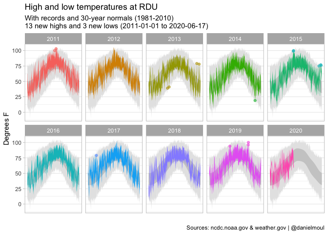<!-- -->  

Normals smooth out the variation that is common in our weather. Over the
last decode there have been many more days above average temperature
than below average. The dotted line indicates half the year.

 

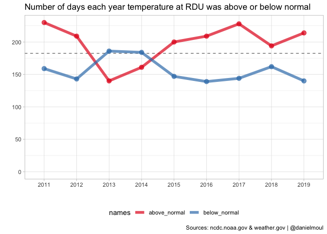<!-- -->

 

We see high and low records spread apparently randomly throughout the
year. There was an unusually large number of record lows from the 1960s
to early 1980s. Since then there has been an unusually large number of
record highs.

 

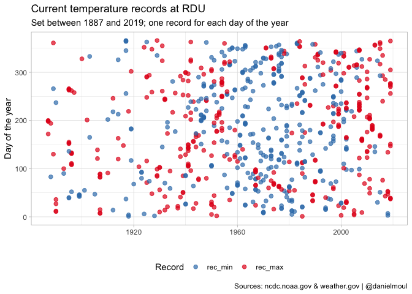<!-- -->

 

When ordered temperature instead of day of year on the Y axis, we again
see the spread of highs and lows, a record high in winter is a lot
colder than a record high in summer).

 

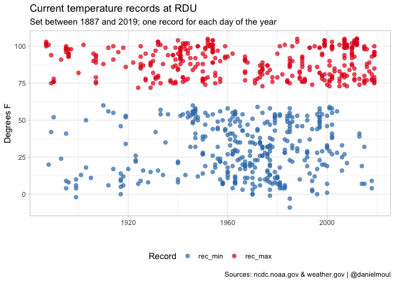<!-- -->

 

We see the same decadal dynamic if we count current records by decade.

 

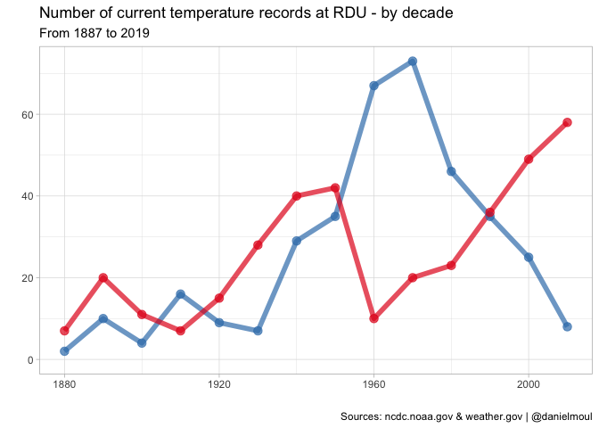<!-- -->

 

## Precipitation

 

It’s been much wetter than normal this last decade, and we see a pattern
in which the first couple of months are extra-dry, then by the end of
spring the the area is above normal precipitation. Only 2011 and 2012
experienced extended periods that were dryer than normal. In 2018
Hurricane Florence pushed the yearly precipitation above the 99th
percentile.

 

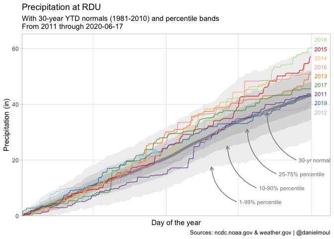<!-- -->

 

Rainfall histogram, considering only days when there was precipitation.

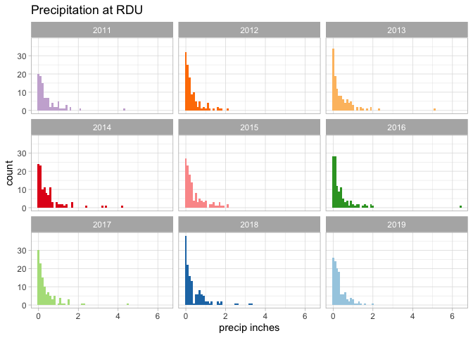<!-- -->

 

Density plots provide a smoothed view. The most common weekly rainfall
is quite small, and very large rain events are very rare. In the
following right-hand plot the X axis is on the \(log_{10}\) scale, which
makes visible the density curve between zero and one inch of rain–the
most common amounts.

 

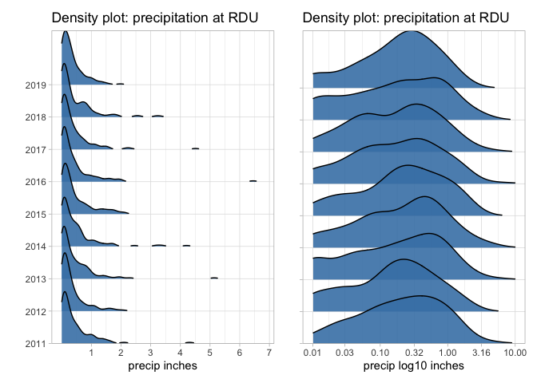<!-- -->

 

Counting the number of days at least so much rain fell at RDU. We see a
trend over the decade: an increase in the number of days wth rain.

 

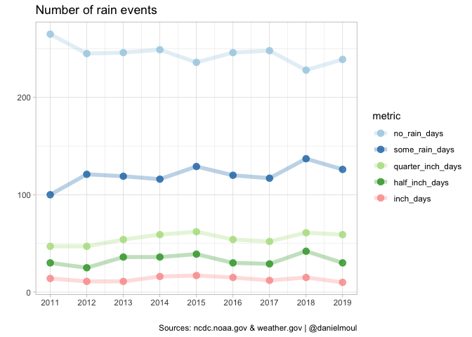<!-- -->

 

Since the late 1980s there have a been an unusual number of days with 4+
inches that set records.

 

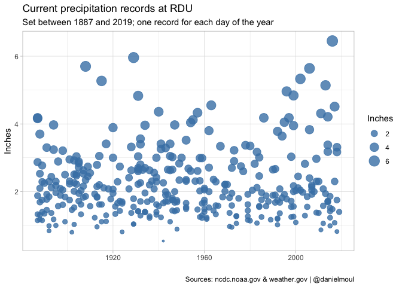<!-- -->

 

However if we count the number of current records by decade, recent
decades do not seem extraordinary in this respect.

 

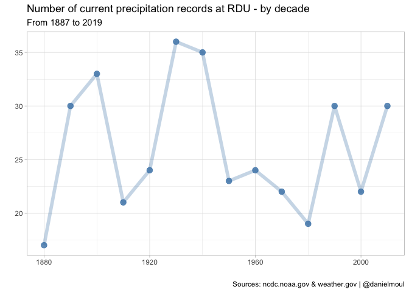<!-- -->
 

## Notes and sources

Inspiration, patterns and a little code reuse:

  - <https://johndjohnson.info/post/how-to-build-a-tufte-style-weather-graph-in-r-using-ggplot2/>
  - <https://johndjohnson.info/post/retrieving-precipitation-data-from-noaa/>

 

Data sources

  - NOAA Local Climatological Data:
    <https://www.ncdc.noaa.gov/cdo-web/datatools/lcd>
  - Normals:
      - <https://www.ncdc.noaa.gov/data-access/land-based-station-data/land-based-datasets/climate-normals/1981-2010-normals-data>
      - <ftp://ftp.ncdc.noaa.gov/pub/data/normals/1981-2010/>
      - <http://ftp.ncdc.noaa.gov/pub/data/normals/1981-2010/products/precipitation/ytd-prcp-normal.txt>
  - Documentation describing methodology for calculating normals:
      - <ftp://ftp.ncdc.noaa.gov/pub/data/normals/1981-2010/documentation/1981-2010-normals-overview.pdf>
      - <ftp://ftp.ncdc.noaa.gov/pub/data/normals/1981-2010/documentation/precipitation-methodology.pdf>
      - <ftp://ftp.ncdc.noaa.gov/pub/data/normals/1981-2010/documentation/temperature-methodology.pdf>
      - <ftp://ftp.ncdc.noaa.gov/pub/data/normals/1981-2010/documentation/daily-temperature-normals-methodology.pdf>
  - Daily summaries:
    <https://www.ncdc.noaa.gov/cdo-web/datasets/GHCND/stations/GHCND:USW00013722/detail>
      - RDU: 1981-2010 to calculate standard deviation of YTD
        precipitation
      - RDU: 2011-2020-06-18 daily summaries
  - Temperature and precipitation records for RDU
      - <https://www.weather.gov/rah/rdutemperaturerecords>

   

(end of document)
